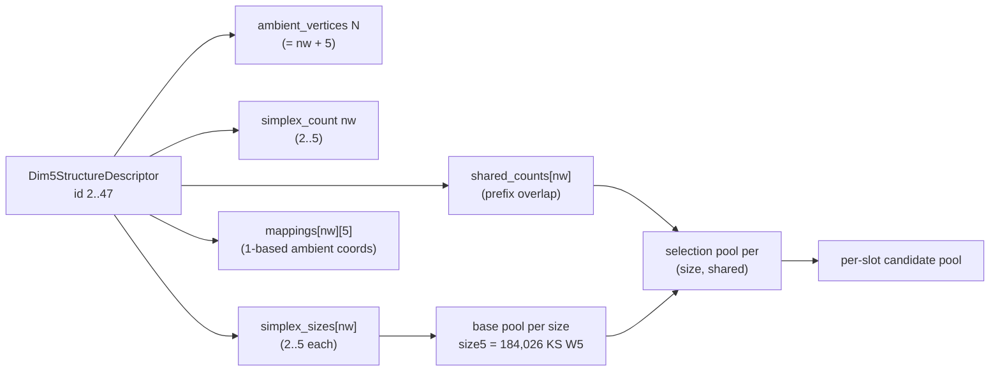
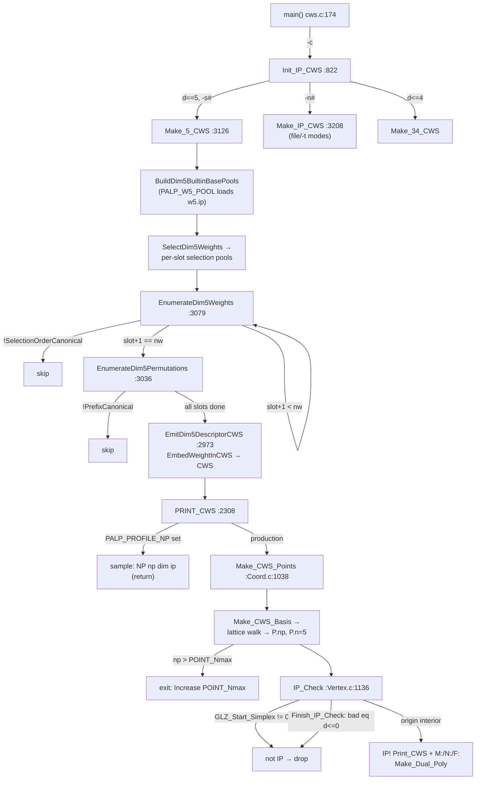
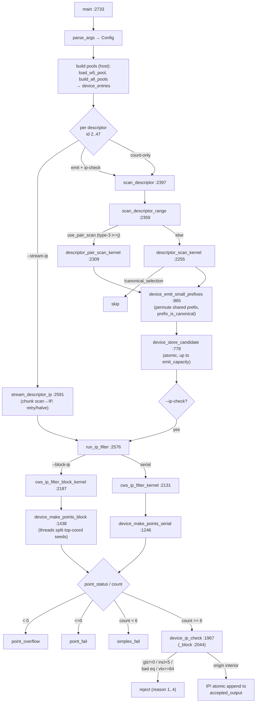
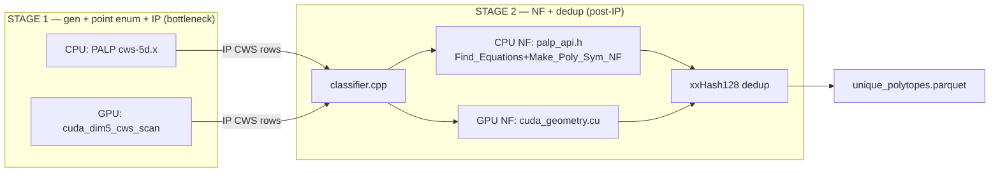

# CWS Generation + IP-Check Pipeline — Complete Code Paths (CPU & GPU)

> Repo memory for the dim-5 reflexive-polytope classification effort.
> This document traces **every branch, function call, and return** in the
> "pick a CWS type → generate candidates → enumerate points → IP-check" flow,
> for both the CPU reference (PALP) and the GPU port (`src/classify`).
> File:line references are accurate as of branch `formal-verification`
> (commit `f5949ac`). Companion docs: `ARCHITECTURE.md` (downstream NF/dedup),
> `CUDA_ARCHITECTURE.md` (kernel-stage design), `COMBINED_CWS_SCHEMA.md`
> (parquet schema).

---

## 0. The big picture

Two independent implementations compute the **same** thing — the set of
IP (interior-point) combined weight systems for each of the 46 canonical
dim-5 overlap structures — and a third stage classifies the survivors:

```
            ┌─────────────────────────────────────────────────────────────┐
            │  STAGE 1: CWS generation + point enumeration + IP check       │
            │                                                               │
   CPU ───► │  PALP cws-5d.x  (PALP/cws.c, Coord.c, Vertex.c)               │
   GPU ───► │  cuda_dim5_cws_scan  (src/classify/cuda_dim5_cws_scan.cu)     │
            └─────────────────────────────────────────────────────────────┘
                                       │  IP-passing CWS rows
                                       ▼
            ┌─────────────────────────────────────────────────────────────┐
            │  STAGE 2 ("etc."): normal form + dedup  (post-IP)             │
            │  classifier (classifier.cpp) → NF via                         │
            │    CPU backend palp_api.h / GPU backend cuda_geometry.cu      │
            │    → xxHash128 dedup → unique_polytopes.parquet               │
            └─────────────────────────────────────────────────────────────┘
```

The point-enumeration routine inside Stage 1 is the bottleneck and the target
of the optimization effort. The np (lattice-point count) distribution that
feeds the GPU bucketing strategy was measured in
`results/point-count-profile/structure-{3,12}/summary.txt`.

**Key dimensional invariant:** every candidate has `N = nw + 5` ambient
homogeneous coordinates (`N` = `ambient_vertices`, `nw` = number of weight-system
rows). `Make_CWS_Points` sets `P->n = B.n =` ambient lattice dim `= 5` for every
*valid* candidate — it is **not** the affine-hull dimension, so degenerate
candidates (np = 1,2,3…) still report `dim = 5`. Full-dimensionality is decided
by the point count (`< 6` points ⇒ cannot be a 5-simplex ⇒ rejected before the
IP search) and ultimately by the IP check.

---

## 1. The 46 CWS structure types

### 1.1 Source of truth

`PALP/dim5_structures.inc` defines `static const Dim5StructureDescriptor
kDim5Structures[]` with **46 entries, IDs 2…47**. The exact same table is
re-declared on the GPU side in `src/classify/cuda_dim5_cws_scan.cu` (struct
`Dim5StructureDescriptor`, line 39) so both implementations enumerate
identically.

### 1.2 Descriptor schema

`Dim5StructureDescriptor` (PALP/cws.c:23):

| field | meaning |
|---|---|
| `id` | structure id, 2…47 |
| `ambient_vertices` (N) | number of homogeneous coordinates: 7, 8, 9, or 10 |
| `simplex_count` (nw) | number of weight-system rows ("simplices"): 2, 3, 4, or 5 |
| `simplex_sizes[5]` | length (support size) of each weight system, each 2…5 |
| `shared_counts[5]` | how many *leading* coordinates of slot *j* are shared with earlier slots |
| `mappings[5][5]` | 1-based ambient-coordinate index each weight in a row lands on (`0` = unused) |

A descriptor says: place `nw` weight systems, the *j*-th of length
`simplex_sizes[j]`, into `N` ambient coordinates following `mappings[j]`, where
the first `shared_counts[j]` coordinates of slot *j* coincide with coordinates
already used by earlier slots. Always `N = nw + 5`.

### 1.3 Worked examples

```
id 2 : N=7  nw=2  sizes{2,5}      shares{0,0}
        slot0 → coords {1,2}      slot1 → {3,4,5,6,7}        (disjoint)
id 3 : N=7  nw=2  sizes{5,5}      shares{3,3}
        slot0 → {1,2,3,4,5}       slot1 → {1,2,3,6,7}        (share 1,2,3)
id 12: N=8  nw=3  sizes{4,4,5}    shares{4,2,3}
        slot0 → {1,2,3,4}  slot1 → {1,2,5,6}  slot2 → {1,3,4,7,8}
id 47: N=10 nw=5  sizes{2,2,2,2,2} shares{0,0,0,0,0}
        five disjoint P^1 factors
```

### 1.4 Grouping by arity

| nw | structure IDs | count |
|---|---|---|
| 2 | 2 – 7 | 6 |
| 3 | 8 – 32 | 25 |
| 4 | 33 – 45 | 13 |
| 5 | 46 – 47 | 2 |
| **total** | | **46** |

### 1.5 Per-slot weight pools

Each slot draws weights from a **base pool** indexed by `simplex_size`:

- size 2 → the length-2 IP weight systems, size 3 → length-3, size 4 → length-4;
- **size 5 → the 184,026 published Kreuzer–Skarke length-5 IP weight systems**
  (`results/cache/w5.ip`, format `degree w0 w1 w2 w3 w4`).

From a base weight, `SelectDim5Weights` (CPU) / `enumerate_selections` (GPU)
produces a **selection pool** for each `(simplex_size, shared_count)` pair:
it chooses which `shared_count` of the weight's entries are the "shared"
(prefix) coordinates. Pools with the same `(size, shared)` are cached/shared.

Pool sizes encountered in practice (both implementations identical):
- type 3: both slots = size-5/shared-3 pool = **1,833,327** entries (and the
  two slots draw from the *same* pool ⇒ canonical `i ≤ j` pair enumeration).
- type 12: slot0 = size-4/shared-4 = **95**, slot1 = size-4/shared-2 = **526**,
  slot2 = size-5/shared-3 = **1,833,327** (independent family groups ⇒ full
  Cartesian product).

---

## 2. CPU pipeline — PALP `cws-5d.x`

Built from `PALP/cws.c` (+ `Coord.c`, `Vertex.c`) with `-DPOLY_Dmax=5`.
Invocation for canonical dim-5 generation: `cws-5d.x -c5 -s<id> [-j J -k k]`.

### 2.1 Entry & dispatch

```
main()                                   cws.c:174
  └─ fn[1][1] switch:
       '-c' → Init_IP_CWS()              cws.c:188 → 822
       (others: -w -m -i -N -p -x -S -L -d -2 → unrelated tools)

Init_IP_CWS(narg, fn)                     cws.c:822
  ├─ ResetDim5RuntimeOptions()           (shard_count=1, shard_index=0)
  ├─ parse dim d after "-c"
  ├─ loop over args:
  │     "-n"             → nop=1; break      (generic infile mode)
  │     "-s <id>"        → structure_id
  │     "-j <J>"         → ParseDim5ShardCountOption    cws.c:2049
  │     "-k <k>"         → ParseDim5ShardIndexOption     cws.c:2054 (stores k-1)
  │     else            → Die("illegal option after -c#")
  ├─ if (-j/-k modified) && d!=5 → Die
  └─ branch:
        nop            → Make_IP_CWS()    cws.c:869  (explicit weight files / -t types)
        d ≤ 4          → Make_34_CWS(d)   cws.c:873
        d == 5         → Make_5_CWS(structure_id)   cws.c:875  ◄── canonical path
        else           → Die
```

`Make_IP_CWS` (cws.c:3208) is the alternate, file-driven path: `-n#` input
weight files + either `-s#` (same descriptor machinery, pools loaded from files,
cws.c:3334–3394) or legacy `-t TYPE…` combinations (`Make2CWS`, `Make_111_CWS`,
`Make_221_CWS`, `Make_211_CWS`, `Make_nno_CWS`, …, cws.c:3395–3459). The
production scan uses the builtin `Make_5_CWS` path below.

### 2.2 Structure setup — `Make_5_CWS`

```
Make_5_CWS(structure_id)                  cws.c:3126
  ├─ ValidateDim5RuntimeOptions()         cws.c:2061  (k must be < J)
  ├─ scan kDim5Structures; restrict to structure_id if set;
  │     set need_five_weights if any selected size==5
  ├─ BuildDim5BuiltinBasePools(base_pools, need_five_weights)   (call at 3151)
  │     • size 2/3/4 pools generated;
  │     • size 5 pool: if env PALP_W5_POOL set → LoadDim5BasePoolFromFile()
  │       (our profiling edit — skips the ~4 min Make_34_Weights(4,0,0)
  │        regeneration of the 184k W5 systems); else regenerate.
  └─ for each matching descriptor:
       ├─ ComputeDim5SlotOrbitGroups(descriptor, orbit_groups)  cws.c:2913
       │     (assigns orbit ids to slots related by a descriptor automorphism)
       ├─ for each slot j:
       │     build selection_cache[size][shared] via SelectDim5Weights() over
       │       base_pools[size];  AUXPOOL[j] = that pool;
       │     family_groups[j] = Dim5CombineFamilyGroup(size, orbit_group[j])
       └─ MakeDim5DescriptorCWS(descriptor, AUXPOOL, family_groups)   cws.c:3109
            └─ builds Dim5EnumerationContext, then EnumerateDim5Weights(ctx, 0)
```

### 2.3 Candidate enumeration (the Cartesian product + canonicalization)

```
EnumerateDim5Weights(ctx, slot)           cws.c:3079   (recursive over slots)
  ├─ if slot ≥ simplex_count → return
  ├─ pool = inputs[slot]; if NULL → return
  └─ for index = 1 .. pool->count:
        ├─ if slot==0 && !Dim5IndexBelongsToShard(index, J, k) → continue
        │      Dim5IndexBelongsToShard: ((index-1) % J) == k          cws.c:2066
        ├─ ctx->weights[slot] = pool->items[index-1]; ctx->indices[slot]=index
        └─ if Dim5SelectionOrderIsCanonical(ctx, slot):               cws.c:3068
               (reject if an earlier slot in the SAME family_group has a
                STRICTLY LARGER index — enforces non-decreasing index order
                within a family group ⇒ kills slot-swap duplicates)
             ├─ if slot+1 == simplex_count → EnumerateDim5Permutations(ctx, 0)
             └─ else                        → EnumerateDim5Weights(ctx, slot+1)

EnumerateDim5Permutations(ctx, slot)      cws.c:3036   (recursive over slots)
  ├─ if slot ≥ simplex_count → EmitDim5DescriptorCWS(ctx); return
  ├─ shared_count = shared_counts[slot]
  ├─ if shared_count < 2 → EnumerateDim5Permutations(ctx, slot+1); return
  └─ for each permutation of the shared prefix (NextPrefixPermutation):
        apply prefix to ctx->weights[slot].w[0..shared_count)
        if Dim5PrefixIsCanonical(ctx, slot):                         cws.c:2997
            (keep prefix only if, for every pair of shared coords that look
             identical to ALL earlier slots, the weights are non-decreasing —
             breaks the residual coordinate-permutation symmetry)
          → EnumerateDim5Permutations(ctx, slot+1)
        restore original prefix

EmitDim5DescriptorCWS(ctx)                cws.c:2973
  ├─ CWS CW; for each slot: EmbedWeightInCWS(&CW, weight, N, mapping)  (~2950)
  │     (scatters each weight system's entries into ambient columns via mapping)
  └─ PRINT_CWS(&CW)                        cws.c:2308
```

### 2.4 Per-candidate: point enumeration + IP check — `PRINT_CWS`

```
PRINT_CWS(CW)                             cws.c:2308
  ├─ [profiling hook] if env PALP_PROFILE_NP=<stride> (our edit):
  │     sample every stride-th candidate; Make_CWS_Points; IP_Check;
  │     print "NP <np> <dim> <ip>"; return.            cws.c:2324–2355
  ├─ #if !Only_IP_CWS  → Print_CWS(CW); newline.       cws.c:2356  (DISABLED)
  └─ #else  (Only_IP_CWS == 1, the production path):    cws.c:2361
        ├─ CW->index = 1
        ├─ Make_CWS_Points(CW, P)          ◄── POINT ENUMERATION (bottleneck)
        └─ if IP_Check(P, &V, &E):          ◄── IP CHECK
              ├─ Print_CWS(CW)
              ├─ r = (all facet eq c==1)?   (reflexive flag; non-reflexive kept)
              ├─ Make_Dual_Poly(P,&V,&E,DP)
              ├─ print " M:%d %d"  (np, nv)
              ├─ print r ? " N:%d %d"(DP->np,E.ne) : " F:%d N:%d"(E.ne,DP->np)
              ├─ assert(IP_Check(DP, …))    (dual must also be IP)
              └─ newline
           else: (not IP) → nothing emitted, candidate dropped.
```

Note `Only_IP_CWS 1` (cws.c:7): every candidate runs `Make_CWS_Points`, but
only IP-passing ones print. Non-reflexive-but-IP candidates are **kept**
(the `F:` branch); reflexivity is reported, not filtered.

### 2.5 Point enumeration — `Make_CWS_Points`

```
Make_CWS_Points(Cin, P)                    Coord.c:1038
  ├─ #ifndef NO_COORD_IMPROVEMENT: CWS_to_PermCWS(Cin,&Caux,pi)   (coord reorder)
  ├─ Make_CWS_Basis(_C, &B)                 → triangular lattice basis B (dim B.n)
  ├─ X0 reference point:
  │     index==1 → X0[i]=1 for all i
  │     else     → Compute_X0(); if fails → P->n=0; "no X0!"; return
  ├─ P->n = B.n                             (== 5 for valid dim-5 CWS)
  ├─ compute Amin[] inversion structure and Xmax[] (per-coord upper bounds)
  ├─ nested integer walk over basis coords j = B.n-1 … 0:
  │     compute [xmin[j], xmax[j]] from X0, Xmax, and partial sums;
  │     when j hits 0: inner loop x[0] = xmin[0] … xmax[0]:
  │        store point into _P->x[++_P->np]
  │        if _P->np == POINT_Nmax → use xaux; if > → "Increase POINT_Nmax"; exit(0)
  └─ if (m=nz): CWS_2_SublatZ + Reduce_PPL_2_Sublat   (sublattice; nz==0 here)
```

Output: `P->np` lattice points in `P->x`, `P->n = 5`. This is the routine whose
np distribution was profiled. `POINT_Nmax = 2,000,000` for `POLY_Dmax==5`
(PALP/Global.h) — the hard ceiling and the source of the GPU `ip_max_points`
default.

### 2.6 IP check — `IP_Check`

```
IP_Check(P, V, F)                          Vertex.c:1136
  ├─ alloc CEq, CEq_I, F_I
  ├─ if GLZ_Start_Simplex(P, V, CEq):       (cannot build a full-dim simplex
  │       free; return 0                     containing the origin ⇒ NOT IP)
  ├─ for each CEq: CEq_I[i] = Eq_To_INCI();  if INCI_abs < P->n → "Bad CEq"; exit
  ├─ F->ne = 0
  └─ return Finish_IP_Check(P, V, F, CEq, F_I, CEq_I)        Vertex.c:1122
        while CEq->ne ≥ 0:
          if IP_Search_Bad_Eq(CEq, F, …, &IP):
             if !IP → return 0              (found facet with d ≤ 0 ⇒ origin not
                                             strictly interior ⇒ NOT IP)
             V->v[V->nv++] = Search_New_Vertex(…)
             Make_New_CEqs(…)               (refine candidate equation list)
        return 1                            (origin interior ⇒ IP)
```

`Find_Equations` (Vertex.c:1089) is the sibling used in the **NF** stage: same
machinery but via `Finish_Find_Equations`, returning vertices+facets even when
not IP. `Make_Dual_Poly` (Vertex.c:1209) builds the dual for the `M:/N:/F:`
output and the reflexivity assertion.

---

## 3. GPU pipeline — `cuda_dim5_cws_scan`

`src/classify/cuda_dim5_cws_scan.cu`, built by `src/classify/CMakeLists.txt`
(target `cuda_dim5_cws_scan`, line 152). A separate specialized binary
`cuda_type3_55_scan` (line 143) exists for the type-3 hot path. The general
scan is described here.

### 3.1 Host entry & configuration — `main`

```
main(argc, argv)                          cuda_dim5_cws_scan.cu:2733
  ├─ Config config = parse_args(...)       (Config struct at :202)
  │     w5_path=results/cache/w5.ip, structure_id / --all, blocks/threads,
  │     shard_count/shard_index, emit_capacity, ip_check, stream_ip, block_ip,
  │     ip_stage_profile, ip_max_points=2,000,000 (==POINT_Nmax),
  │     accepted_output_path.  Constraints: --ip-check needs --emit-capacity>0;
  │     --stream-ip implies --ip-check.    (:333–335)
  ├─ cudaSetDevice(config.cuda_device)      (SLURM device, slurm_default_cuda_device :25)
  ├─ cudaDeviceSetLimit(stackSize, 1MB)
  ├─ if block_ip && !threads_explicit → threads = 32
  ├─ if blocks==0 → blocks = SM_count * (block_ip ? 256 : 16)
  ├─ if ip_check: cudaMemGetInfo → cap blocks so per-slot point workspace
  │     (ip_max_points*5*8 B + DeviceIpScratch) fits 70% of free VRAM
  │     (reduce grid only; every candidate still processed).        :2755–2776
  ├─ POOL BUILD (host):
  │     w5_pool      = load_w5_pool(w5_path)            (184k base size-5)
  │     pools        = build_all_pools(palp_cws_path, w5_pool)
  │                       (mirrors SelectDim5Weights per (size,shared))
  │     flat_entries = flatten_pools(pools)  → cudaMemcpy → device_entries
  ├─ cudaMalloc device_stats; if emit_capacity>0 cudaMalloc device_candidates
  └─ for descriptor in kDim5Structures (id 2..47; skip if !all && id != structure_id):
        device_descriptor = make_device_descriptor(descriptor, pools)
        ├─ MODE A: if config.stream_ip → stream_descriptor_ip(...)       :2830
        └─ MODE B: else scan_descriptor(...) then optionally:           :2846
              if emit_capacity>0: optionally copy/print some candidates;
              if ip_check → run_ip_filter(device_candidates, stored_count, …)
```

There are **three host run modes**:

| mode | flags | what runs |
|---|---|---|
| count-only | (no `--emit-capacity`) | scan kernel only; reports tuple/prefix/candidate counts |
| emit + in-place IP | `--emit-capacity N [--ip-check]` | scan stores ≤N candidates, then one IP-filter pass over them |
| stream IP | `--stream-ip` | chunked scan→IP over the entire shard, no giant buffer |

### 3.2 Candidate generation kernels

```
scan_descriptor(desc, …)                  :2397
  ├─ descriptor_shard_range(desc, config, &start, &count)    :949
  │     scan_space = descriptor_scan_space(desc);
  │     start = scan_space*shard_index / shard_count;  (contiguous block split —
  │     end   = scan_space*(shard_index+1)/shard_count; NOTE: different sharding
  │     count = end-start;                              than the CPU stride mod!)
  └─ scan_descriptor_range(...)             :2359
        cudaMemset stats;
        if use_pair_scan(desc) → descriptor_pair_scan_kernel<<<blocks,threads>>>
        else                   → descriptor_scan_kernel<<<blocks,threads>>>
        cudaDeviceSynchronize; copy stats → HostScanResult

use_pair_scan(desc)                        :922
  true iff simplex_count==2 AND both slots share family group, pool offset, and
  pool count (i.e. both slots draw the SAME pool — the type-3 i≤j case).
```

```
descriptor_scan_kernel(...)               :2255   (general Cartesian product)
  grid-stride over linear tuple indices in [start, start+count):
    decode per-slot selection indices via mixed radix over pool_counts  :2274
    canonical_selection = no earlier same-family-group slot has larger index :2281
    if !canonical_selection → continue
    gather tuple_entries[slot] from device_entries
    local_prefix += device_count_small_prefixes(desc, entries)          :751
    if emitting → device_emit_small_prefixes(desc, entries, out, cap, stats)
  atomicAdd selection_tuples / canonical_selection_tuples / prefix_candidates

descriptor_pair_scan_kernel(...)          :2309   (type-3 i≤j pairs)
  grid-stride over linear pair indices:
    left  = device_pair_left_from_linear(pair_index, pool_count)        :905
    right = left + (pair_index - device_first_pair_for_left(left,...))   :900
    if id==3 → device_type3_prefix_count / device_emit_small_prefixes (:964,978)
    else      → device_count_small_prefixes / device_emit_small_prefixes
```

Prefix emission = GPU analog of `EnumerateDim5Permutations`:

```
device_emit_small_prefixes(...)           :865   (dispatch by simplex_count)
  simplex_count==2 → device_emit_last_slot(slot 1)                       :838
  simplex_count==3 → permute slot-1 shared prefix, then emit_last_slot(2):874
  else             → device_emit_prefixes(slot 1)                        :805

device_emit_prefixes(desc, entries, slot) :805   (recursive, all slots)
  slot ≥ count                  → device_store_candidate(...)            :778
  shared_count < 2              → recurse slot+1
  else for each device_next_permutation(prefix):                        :650
        apply prefix; if device_prefix_is_canonical(desc,entries,slot)  :678
            → recurse slot+1;  restore prefix

device_store_candidate(...)               :778
  output_index = atomicAdd(&stats->stored_candidate_count, 1)
  if output_index < candidate_capacity → write DeviceCwsCandidate to candidate_output
  (i.e. counts ALL prefixes but only STORES up to capacity)
```

### 3.3 IP-filter kernels

```
run_ip_filter(device_candidates, generated_count, config, accepted_out)  :2576
  ├─ allocate_ip_workspace(&ws, count, ip_max_points, ip_workspace_slots) :2422
  │     points  = slots * ip_max_points * 5 longs;  scratch = slots * DeviceIpScratch;
  │     accepted = capacity * DeviceCwsCandidate.  slots = (block_ip ? #blocks
  │     : #threads) capped to candidate_count.                            :2488
  └─ run_ip_filter_with_workspace(...)      :2498
        if block_ip → cws_ip_filter_block_kernel<<<blocks,threads>>>      :2516
        else        → cws_ip_filter_kernel<<<blocks,threads>>>            :2523
        sync; copy DeviceIpStats → HostIpResult

stream_descriptor_ip(...)                 :2591   (mode C)
  descriptor_shard_range → [shard_start, shard_end)
  chunk_span = emit_capacity / max_prefix_variants_per_selection
  while position < shard_end:
    scan_descriptor_range(position, range_count)  → stored_candidate_count
    if stored_candidate_count > emit_capacity:    (overflow)
        if range_count==1 → throw (single selection exceeds capacity)
        else chunk_span /= 2; ++retries; continue
    run_ip_filter_with_workspace(stored_count); accumulate; position += range_count
```

Serial IP kernel (one candidate per thread):

```
cws_ip_filter_kernel(...)                 :2131
  grid-stride over candidates; per candidate:
    point_status = device_make_points_serial(candidate, points, max, &point_count) :1246
    atomicAdd processed
    point_status < 0           → point_overflow      (exceeded ip_max_points)
    ==0 || point_count ≤ 0     → point_fail
    point_count < 6            → simplex_fail         (can't span 5 dims)
    else:
       is_ip = device_ip_check(points, point_count, scratch, &reject_reason, stage):1967
         reject 1 simplex_fail | 2 initial_inci_fail | 3 vertex_overflow | 4 ip_reject
       if is_ip → accepted_index = atomicAdd(ip_count); store candidate if room
```

Block IP kernel (one candidate per block, threads cooperate):

```
cws_ip_filter_block_kernel(...)           :2187
  grid-stride over candidates by blockIdx; per candidate:
    device_make_points_block(candidate, points, max, &point_count, &precheck_failed) :1438
       thread0 does precheck + basis + top-coord range; then
       threads split the top-coordinate "seeds" and each runs
       device_make_points_walk_seed(...)  :1362  (atomic append, atomic overflow flag)
    thread0 records stats; __syncthreads
    if point_status>0 && point_count≥6:
       is_ip = device_ip_check_block(points, point_count, scratch, &reject) :2044
          (thread0-driven GLZ + INCI; cooperative search_bad_eq/search_vertex;
           __syncthreads between rounds)
       thread0 stores accepted candidate if IP
```

### 3.4 Device point enumeration (port of `Make_CWS_Points`)

```
device_make_points_serial(candidate, points, max, &count)   :1246
  ├─ device_candidate_basic_precheck(candidate, x_upper)     :1184
  │     nw∈[1,5]; N∈[1,10]; N-nw==5; each row weights ≥0 and sum==degree>0;
  │     per-coord upper bound x_upper[c]=min_row(degree/weight); coord must have
  │     support; early gate: at least 6 lattice points reachable.  fail → 0
  ├─ device_make_cws_basis(candidate, &basis_dim, basis)     :1139
  │     iterated device_solve_next_weight_equation to reduce to the 5-dim
  │     lattice basis; if final dim != 5 → 0
  ├─ build amin[] inversion + x0[]=1
  └─ nested integer walk identical in structure to Coord.c:
        inner loop appends via device_append_ip_point; on overflow (≥max) → -1
     return count>0 ? 1 : 0
```

`device_make_points_block` (:1438) is the same math with thread0 doing setup
into __shared__ and the top coordinate's range distributed across threads as
"seeds" fed to `device_make_points_walk_seed` (:1362); a shared `overflow` flag
and atomic `point_count` make it cooperative.

### 3.5 Device IP check (port of `IP_Check`)

```
device_ip_check(points, count, scratch, &reject_reason, stage)   :1967
  ├─ if device_glz_start_simplex(...) != 0 → reject_reason=1; return 0   :1620
  │     (builds origin-containing 5-simplex via orthogonal-basis reduction
  │      device_orthbase_red_by_v / device_new_start_vertex; nonzero ⇒ not full-dim)
  ├─ for each candidate eq: ceq_inci = device_eq_to_inci();
  │     if device_inci_abs(...) < 5 → reject_reason=2; return 0
  └─ loop while candidate_equations->ne ≥ 0:
        if device_ip_search_bad_eq(...,&ip):                   :1843
           if !ip → reject_reason=4; return 0   (facet d ≤ 0 ⇒ origin not interior)
           if vertex_count ≥ 64 → reject_reason=3; return 0    (vertex overflow)
           vertices[vc++] = device_search_new_vertex(...)      :1763
           device_make_new_ceqs(...)                           :1779
     return 1   (IP)
```

`device_ip_check_block` (:2044) is the same control flow, thread0-serialized for
the bookkeeping with `device_ip_search_bad_eq_block` / `device_search_new_vertex_block`
doing the per-point scans across the block and `__syncthreads()` between rounds.

---

## 4. CPU ⇄ GPU correspondence

| stage | CPU (PALP) | GPU (`cuda_dim5_cws_scan.cu`) |
|---|---|---|
| structure table | `kDim5Structures` (dim5_structures.inc) | `kDim5Structures` (re-declared, line 39) |
| base + selection pools | `BuildDim5BuiltinBasePools` / `SelectDim5Weights` | `load_w5_pool` / `build_all_pools` / `enumerate_selections` |
| slot Cartesian product | `EnumerateDim5Weights` (3079) | `descriptor_scan_kernel` (2255) |
| type-3 i≤j pairs | same product (canonical via index order) | `descriptor_pair_scan_kernel` (2309) |
| selection-order canonical | `Dim5SelectionOrderIsCanonical` (3068) | inline check in scan kernel (2281) |
| shared-prefix permutations | `EnumerateDim5Permutations` (3036) | `device_emit_prefixes`/`_last_slot`/`_small_prefixes` (805/838/865) |
| prefix canonical | `Dim5PrefixIsCanonical` (2997) | `device_prefix_is_canonical` (678) |
| sharding | `Dim5IndexBelongsToShard`: `(index-1)%J==k` (2066) | `descriptor_shard_range`: contiguous block split (949) |
| embed → CWS | `EmbedWeightInCWS` (~2950) | `device_store_candidate` (778) |
| **point enumeration** | `Make_CWS_Points` (Coord.c:1038) | `device_make_points_serial` (1246) / `_block` (1438) |
| basis | `Make_CWS_Basis` | `device_make_cws_basis` (1139) |
| **IP check** | `IP_Check` (Vertex.c:1136) | `device_ip_check` (1967) / `_block` (2044) |
| simplex seed | `GLZ_Start_Simplex` | `device_glz_start_simplex` (1620) |
| NF (Stage 2) | `Find_Equations`+`Make_Poly_Sym_NF` (palp_api.h:97) | `cuda_geometry.cu` `compute_batch` |

**Sharding difference to remember:** CPU `-j J -k k` partitions slot-0 by a
**stride/modulo** (`(index-1)%J==k`), so worker *k* gets every *J*-th slot-0
weight. The GPU `--shard-count/--shard-index` partitions the linear scan space
into **contiguous blocks**. Both cover the full space exactly once across all
shards, but the per-shard *order* differs — relevant when comparing partial
(killed-early) runs.

---

## 5. Stage 2 (post-IP): normal form + dedup ("etc.")

Not the bottleneck, included for completeness of "the entire flow".

```
IP-passing CWS rows
  → cws_to_parquet (cws_to_parquet.cpp)               → parquet shards
  → classifier (classifier.cpp)                        → reads parquet,
       thread pool, per row computes NORMAL FORM via GeometryBackend:
         CPU backend (geometry_backend.cpp):
            palp_compute_nf_from_cws (palp_api.h:175)
              → palp_prepare_cws_from_input (:131)
              → palp_run_nf_pipeline (:123)
                  → Make_CWS_Points (:127)
                  → palp_run_nf_from_current_points (:97):
                       Find_Equations → if !IP return; Sort_VL;
                       Make_Poly_Sym_NF → result->nf
         CUDA backend (cuda_geometry.cu): compute_batch(...) device NF
       → xxHash128(nf) → thread-local hash map → global merge (dedup)
  → unique_polytopes.parquet  (+ add_nf replay columns, COMBINED_CWS_SCHEMA.md)
```

`GeometryBackend` (geometry_backend.h) selects CPU / CUDA / Auto via
`make_geometry_backend`. `--backend auto` prefers CUDA if
`cuda_geometry_available`.

---

## 6. Diagrams (Mermaid)

### 6.1 Structure descriptor data model



### 6.2 CPU pipeline (PALP `cws-5d.x -c5 -s#`)



### 6.3 GPU pipeline (`cuda_dim5_cws_scan`)



### 6.4 End-to-end stages



---

## 7. Invariants, gotchas & optimization hooks

- **`P->n` / `dim` is always 5** for valid candidates (ambient lattice dim, set
  from the basis), never the affine-hull dim. Degeneracy is detected by point
  count, not by `dim`. (CPU Coord.c:1073; GPU `device_make_cws_basis` requires
  `basis_dim == 5`.)
- **Full-dim gate = "≥ 6 points".** A 5-polytope needs ≥ 6 vertices; both sides
  reject `point_count < 6` as `simplex_fail` *before* the IP search (GPU
  :2161/:2224; CPU implicitly via `GLZ_Start_Simplex`).
- **`POINT_Nmax = 2,000,000`** (PALP/Global.h, `POLY_Dmax==5`). CPU `exit(0)`s on
  overflow; GPU returns `-1` (`point_overflow`) and `ip_max_points` defaults to
  the same value — so the GPU never silently drops a candidate, but the
  resulting ~80 MB/slot workspace forces the VRAM-based grid cap in `main`.
  This is the single biggest throughput lever and the reason the np distribution
  was profiled (most candidates have np ≤ 16; see §0).
- **Sharding is not the same on both sides** (modulo-stride vs contiguous
  block). See §4.
- **Selection-order + prefix canonicalization** together remove slot-swap and
  shared-coordinate-permutation duplicates; both must match between CPU and GPU
  for output parity (validated by `src/verify/harness_dim5_*`).
- **Non-reflexive IP kept.** Reflexivity is reported (`N:` vs `F:`), never used
  to filter — consistent with the project decision that the IP point enumeration
  is the cost, not the reflexivity test.
- **Two GPU point kernels.** Serial (`cws_ip_filter_kernel`, one candidate per
  thread) maximizes candidate-level parallelism; block
  (`cws_ip_filter_block_kernel`, one candidate per block, threads split the
  top-coordinate seed range) reduces per-candidate latency for high-np
  candidates. Bucketing by np (the planned optimization) chooses between / sizes
  these per np class.

---

## 8. Source index (quick jump)

| symbol | file:line |
|---|---|
| `kDim5Structures` (CPU) | PALP/dim5_structures.inc:1 |
| `Dim5StructureDescriptor` (CPU) | PALP/cws.c:23 |
| `main` (CPU) | PALP/cws.c:174 |
| `Init_IP_CWS` | PALP/cws.c:822 |
| `Make_5_CWS` | PALP/cws.c:3126 |
| `MakeDim5DescriptorCWS` | PALP/cws.c:3109 |
| `EnumerateDim5Weights` | PALP/cws.c:3079 |
| `EnumerateDim5Permutations` | PALP/cws.c:3036 |
| `Dim5SelectionOrderIsCanonical` | PALP/cws.c:3068 |
| `Dim5PrefixIsCanonical` | PALP/cws.c:2997 |
| `Dim5IndexBelongsToShard` | PALP/cws.c:2066 |
| `EmitDim5DescriptorCWS` | PALP/cws.c:2973 |
| `PRINT_CWS` | PALP/cws.c:2308 |
| `Make_CWS_Points` | PALP/Coord.c:1038 |
| `IP_Check` / `Finish_IP_Check` | PALP/Vertex.c:1136 / 1122 |
| `Find_Equations` | PALP/Vertex.c:1089 |
| `Make_Dual_Poly` | PALP/Vertex.c:1209 |
| `Dim5StructureDescriptor` (GPU) | src/classify/cuda_dim5_cws_scan.cu:39 |
| `main` (GPU) | src/classify/cuda_dim5_cws_scan.cu:2733 |
| `scan_descriptor` / `_range` | …cuda_dim5_cws_scan.cu:2397 / 2359 |
| `descriptor_scan_kernel` | …cuda_dim5_cws_scan.cu:2255 |
| `descriptor_pair_scan_kernel` | …cuda_dim5_cws_scan.cu:2309 |
| `use_pair_scan` | …cuda_dim5_cws_scan.cu:922 |
| `descriptor_shard_range` | …cuda_dim5_cws_scan.cu:949 |
| `device_emit_small_prefixes` / `_prefixes` / `_last_slot` | …:865 / 805 / 838 |
| `device_prefix_is_canonical` | …cuda_dim5_cws_scan.cu:678 |
| `device_store_candidate` | …cuda_dim5_cws_scan.cu:778 |
| `run_ip_filter` / `_with_workspace` | …:2576 / 2498 |
| `stream_descriptor_ip` | …cuda_dim5_cws_scan.cu:2591 |
| `cws_ip_filter_kernel` / `_block_kernel` | …:2131 / 2187 |
| `device_make_points_serial` / `_block` / `_walk_seed` | …:1246 / 1438 / 1362 |
| `device_candidate_basic_precheck` | …cuda_dim5_cws_scan.cu:1184 |
| `device_make_cws_basis` | …cuda_dim5_cws_scan.cu:1139 |
| `device_ip_check` / `_block` | …:1967 / 2044 |
| `device_glz_start_simplex` | …cuda_dim5_cws_scan.cu:1620 |
| NF bridge (CPU) | src/classify/palp_api.h:97,123,175 |
| NF backend (GPU) | src/classify/cuda_geometry.cu |
| classifier / dedup | src/classify/classifier.cpp |
